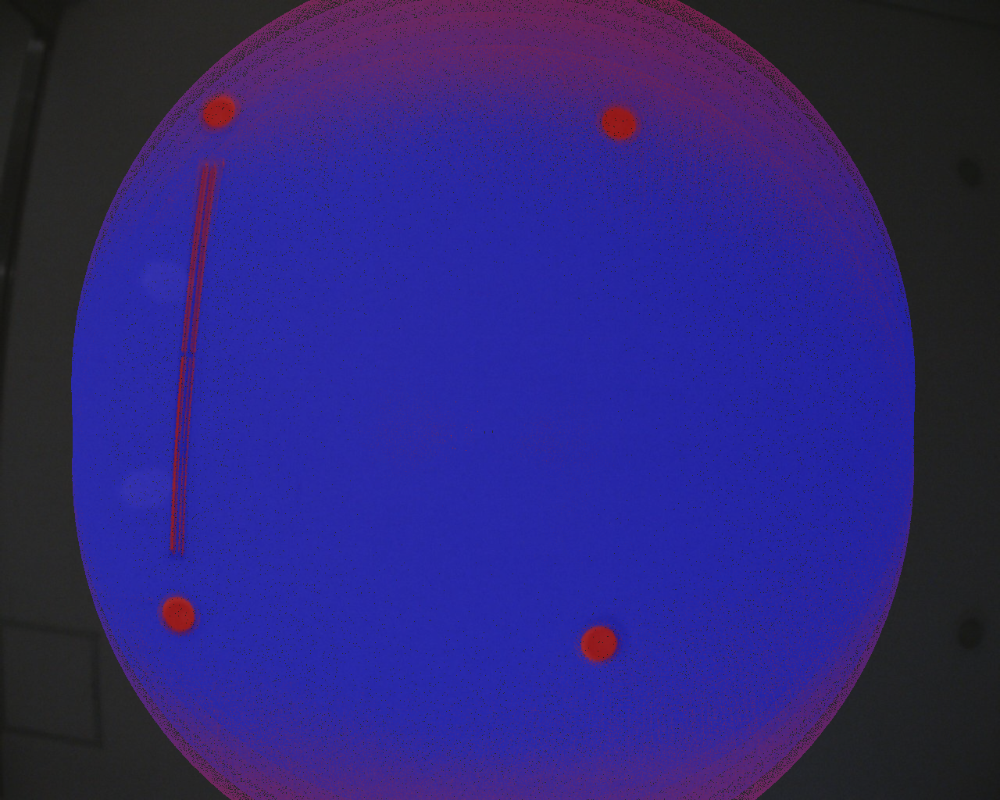
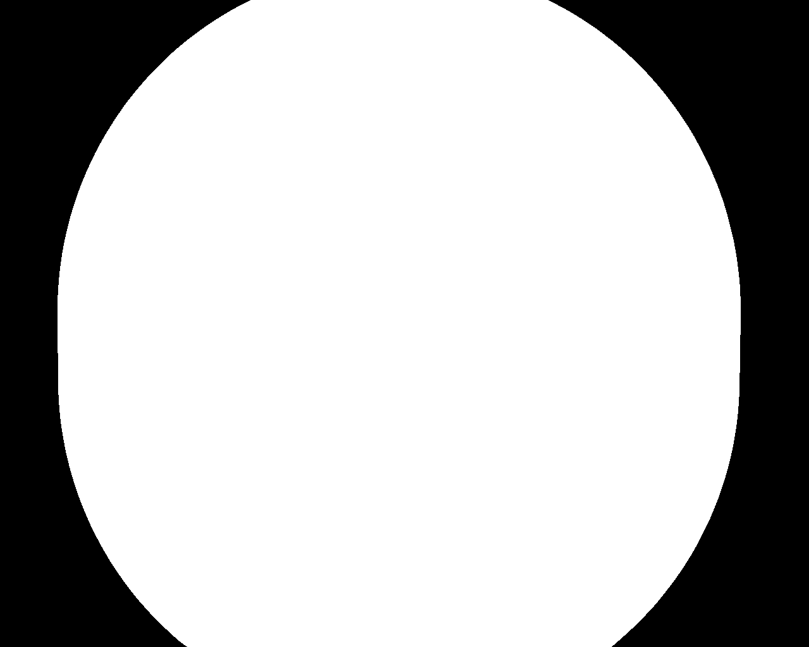
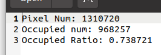

# Livox Camera FOV Calculator
Livox LiDAR & Camera FOV Overlap Calculator.

## Prerequisites

### 1) ROS
Test environment is ROS Noetic

### 2) OpenCV
Test environment is OpenCV 4.4  
It will work well in the Opencv 4.X

### 3) PCL
Test environment is PCL 1.10

### 4) livox_ros_driver
You have to build [livox_ros_driver](https://github.com/Livox-SDK/livox_ros_driver) first

## Build
```bash
$ cd (your_ros_workspace)/src
$ git clone https://github.com/SanghyunPark01/livox_camera_fov_calculator.git
$ cd ..
$ catkin_make
```

## Config
You have to change a number of parameters and paths in `config/setting.yaml`.  

## Run
You have to check `config/setting.yaml` before launch.
```
$ roslaunch livox_camera_fov_calculator run.launch
$ rosbag play (your_bag)
```  

## Result

- **Left**: Accumulate LiDAR Scans and Projection
- **Right**: Fill Projected Scan  
<p align="center">
    
    
</p>

- **result.txt**
<p align="center">
    
</p>

- Video  

https://github.com/user-attachments/assets/24c00ae5-54f8-4514-aa1d-4e009af407d1


## Contact
E-mail 1: pash0302@gmail.com  
E-mail 2: pash0302@postech.ac.kr
